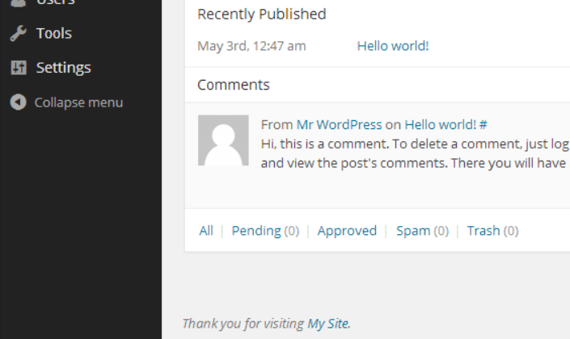

# Personal Admin Footer

* __Requires at least:__ WordPress 2.8
* __Tested up to:__ WordPress 4.3
* __Stable version:__ [1.1.1](http://downloads.wordpress.org/plugin/personal-admin-footer.latest-stable.zip)
* __License:__ [MIT](http://opensource.org/licenses/MIT)

Welcome users to your dashboard with a personal 'Thank you for visiting My Site' in the footer

## Description

This plugin changes the default 'Thank you for creating with WordPress' in your footer area to a more personal 'Thank you for visiting My Site' on all admin pages except the Network Admin. There is no configuration; simply install and activate.

Visit the [plugin homepage](http://bungeshea.com/plugins/personal-admin-footer/), or download it from [WordPress.org](http://wordpress.org/plugins/personal-admin-footer).

## Installation

1. Upload `personal-admin-footer.php` to the `/wp-content/plugins/` directory
2. Activate the plugin through the 'Plugins' menu in WordPress
3. Done!

## Frequently Asked Questions

### This plugin has no settings page! How do I tell it what text to display in the footer?
Personal Admin Footer will automagically pull your site name and home URL address from the General Options page of your WordPress Dashboard *(Settings > General)*.

## Screenshots

